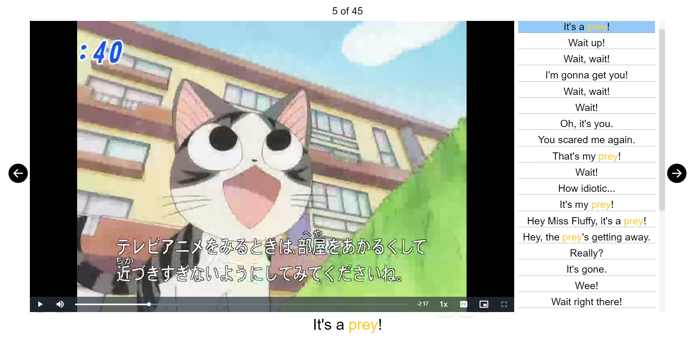

# Video Search

This Anki add-on allows you to search subbed videos in any configured folder for certain phrases and show the results in an embedded video player inside your cards.



To use, you first have to configure some folder in your computer as the media folder the add-on should search in. Go to _Tools > Video Search > Configure media folder_. If you add new files to the configured folder after this, you'll need to run the _Rebuild database_ action.

Currently only WebM videos with WebVTT subs are supported.

The add-on works as a template filter. Try putting something like this in your card template:

```
{{video-search:Front}}
```

Where `Front` is a field containing the phrase you want to search for.

The player behavior can be customized with some options. E.g.

```
{{video-search autoplay=true autopause=false delay=2:Front}}
```

-   Explanation of the options:
    -   `autoplay`: plays video automatically when player is shown. Default is `false`.
    -   `autopause`: pauses the player after the subtitle where the target phrase is found. Default is `true`.
    -   `delay`: Defines a number of seconds to play before the subtitle time where the target phrase is found.

## Credit

This add-on (and many other add-ons) was commissioned by [jergomenzo](https://www.fiverr.com/jergomenzo).

## Changelog

See [CHANGELOG.md](CHANGELOG.md) for a list of changes.

## Support & feature requests

Please post any questions, bug reports, or feature requests in the [support page](https://forums.ankiweb.net/c/add-ons/11) or the [issue tracker](https://github.com/abdnh/anki-video-search/issues).

If you want priority support for your feature/help request, I'm available for hire.
You can get in touch from the aforementioned pages, via [email](mailto:abdo@abdnh.net) or on [Fiverr](https://www.fiverr.com/abd_nh).

## Support me

Consider supporting me if you like my work:

<a href="https://github.com/sponsors/abdnh"></a>
<a href="https://www.patreon.com/abdnh"></a>
<a href="https://www.buymeacoffee.com/abdnh" target="_blank"></a>

I'm also available for freelance add-on development on Fiverr:

<a href="https://www.fiverr.com/abd_nh/develop-an-anki-addon"></a>
